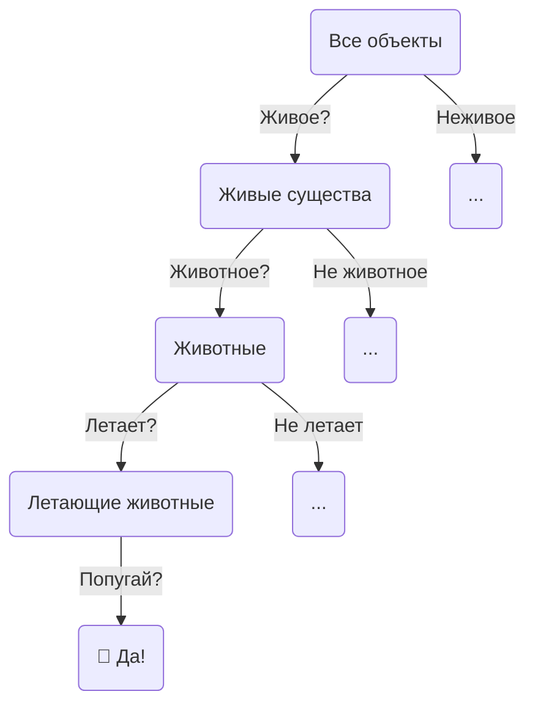

# Игра в 20 вопросов

<br>

<div class="grid grid-cols-[5fr_4fr] gap-20">
<div>

<v-clicks depth="2">

* Загадайте любой предмет...
* Я буду задавать вам вопросы с ответом **да/нет**, чтобы угадать его
  * Это живое? → **Да**
  * Это животное? → **Да**
  * У него 4 ноги? → **Нет**
  * Оно умеет летать? → **Да**
  * Это попугай? → **Да!** 🎉
* Каждый вопрос **разделяет** пространство возможных ответов
* Хорошие вопросы **максимизируют** полученную информацию
* Именно так работают **деревья решений**!

</v-clicks>
</div>
<div>
<v-click at="8">


</v-click>
</div>
</div>

<!--
Эндрю Ын часто мотивирует деревья решений через аналогию «20 вопросов» — это самый естественный способ для людей понять иерархическое принятие решений. Ключевое озарение: каждый вопрос должен максимально снижать нашу неопределённость.
-->

---

# Деревья решений в реальной жизни

### Инженерная блок-схема
<br>
<div class="grid grid-cols-[5fr_8fr] gap-16">
<div>

```mermaid {securityLevel: 'loose', theme: 'neutral', scale: 0.8, flowchart: {'htmlLabels': true}}
graph TD

A(Оно движется?) -->|Нет| B(Должно ли?)
A -->|Да| C(Должно ли?)
B -->|Нет| D(Нет проблем)
B -->|Да| E("WD-40")
C -->|Да| F(Нет проблем)
C -->|Нет| G("Изолента")
```
</div>
<div>
  <figure>
    
      <figcaption style="color:#b3b3b3ff; font-size: 11px; position: absolute;">Источник иллюстрации:<br>
    <a href="https://www.etsy.com/listing/1705553794/wd40-and-duck-tape-holder">https://etsy.com/listing/1705553794/wd40-and-duck-tape-holder</a><br><br>Источник мема:<br>
    <a href="https://www.reddit.com/r/funny/comments/vkqd3/the_engineers_flowchart/">https://reddit.com/r/funny/comments/vkqd3/the_engineers_flowchart</a>
  </figcaption>
  </figure>
</div>
</div>

---

# Пример дерева решений

<div class="grid grid-cols-[4fr_8fr] gap-6">
<div>
<br>
<br>
  <figure>
    
    <figcaption style="color:#b3b3b3ff; font-size: 11px; position: absolute;"><br><br><br><br>Источник примера:<br>
    <a href="https://towardsdatascience.com/decision-tree-an-algorithm-that-works-like-the-human-brain-8bc0652f1fc6">https://towardsdatascience.com/<br>decision-tree-an-algorithm-that-works-like-the-human-brain-8bc0652f1fc6</a>
  </figcaption>
  </figure>
</div>
<div v-click>
  <figure>
    
  </figure>
</div>
</div>

---

# Концепции деревьев решений
<br>
<div class="grid grid-cols-[5fr_8fr] gap-6">
<div>

```mermaid {securityLevel: 'loose', theme: 'neutral', scale: 1.0, flowchart: {'htmlLabels': true}}
graph TD

A(<p style="width:70px;height:25px;"></p>) --> B(<p style="width:70px;height:25px;"></p>)
A --> C(<p style="width:70px;height:25px;"></p>)
B --> D(<p style="width:70px;height:25px;"></p>)
B --> E(<p style="width:70px;height:25px;"></p>)
C --> F(<p style="width:70px;height:25px;"></p>)
F --> H(<p style="width:70px;height:25px;"></p>)
C --> G(<p style="width:70px;height:25px;"></p>)
```
</div>
<div>

</div>
</div>

---

# Концепции деревьев решений
<br>
<div class="grid grid-cols-[5fr_8fr] gap-6">
<div>

```mermaid {securityLevel: 'loose', theme: 'neutral', scale: 1.0, flowchart: {'htmlLabels': true}}
graph TD

A(<p style="width:70px;height:25px;">Корень</p>) --> B(<p style="width:70px;height:25px;"></p>)
A --> C(<p style="width:70px;height:25px;"></p>)
B --> D(<p style="width:70px;height:25px;"></p>)
B --> E(<p style="width:70px;height:25px;"></p>)
C --> F(<p style="width:70px;height:25px;"></p>)
F --> H(<p style="width:70px;height:25px;"></p>)
C --> G(<p style="width:70px;height:25px;"></p>)
style A fill:#f9f,stroke:#333,stroke-width:4px
```
</div>
<div>

* Самый верхний узел - **корень**
</div>
</div>

---

# Концепции деревьев решений
<br>
<div class="grid grid-cols-[5fr_8fr] gap-6">
<div>

```mermaid {securityLevel: 'loose', theme: 'neutral', scale: 1.0, flowchart: {'htmlLabels': true}}
graph TD

A(<p style="width:70px;height:25px;">Корень</p>) --> B(<p style="width:70px;height:25px;">Ветвь 1</p>)
A --> C(<p style="width:70px;height:25px;">Ветвь 2</p>)
B --> D(<p style="width:70px;height:25px;"></p>)
B --> E(<p style="width:70px;height:25px;"></p>)
C --> F(<p style="width:70px;height:25px;">Ветвь 3</p>)
F --> H(<p style="width:70px;height:25px;"></p>)
C --> G(<p style="width:70px;height:25px;"></p>)
style B fill:#b15f55,stroke:#333,stroke-width:4px
style C fill:#b15f55,stroke:#333,stroke-width:4px
style F fill:#b15f55,stroke:#333,stroke-width:4px
```
</div>
<div>

* Самый верхний узел - **корень**

* Промежуточные узлы - **ветви**
</div>
</div>

---

# Концепции деревьев решений
<br>
<div class="grid grid-cols-[5fr_8fr] gap-6">
<div>

```mermaid {securityLevel: 'loose', theme: 'neutral', scale: 1.0, flowchart: {'htmlLabels': true}}
graph TD

A(<p style="width:70px;height:25px;">Корень</p>) --> B(<p style="width:70px;height:25px;">Ветвь 1</p>)
A --> C(<p style="width:70px;height:25px;">Ветвь 2</p>)
B --> D(<p style="width:70px;height:25px;">Лист 1</p>)
B --> E(<p style="width:70px;height:25px;">Лист 2</p>)
C --> F(<p style="width:70px;height:25px;">Ветвь 3</p>)
F --> H(<p style="width:70px;height:25px;">Лист 4</p>)
C --> G(<p style="width:70px;height:25px;">Лист 3</p>)
style D fill:#5cb155,stroke:#333,stroke-width:4px
style E fill:#5cb155,stroke:#333,stroke-width:4px
style H fill:#5cb155,stroke:#333,stroke-width:4px
style G fill:#5cb155,stroke:#333,stroke-width:4px
```
</div>
<div>

* Самый верхний узел - **корень**

* Промежуточные узлы - **ветви**

* Конечные узлы - **листья**
</div>
</div>

---

# Искусство задавать вопросы

### Где разместить порог?

<div class="grid grid-cols-[3fr_11fr] gap-10">
<div>
<v-plotly style="width: 400px !important; height: 195px !important"
:data="[{
x: [0.5, 0.9, 1.8, 2.9, 3.0, 3.9, 4.4, 6.0, 7.5, 8.4],
y: Array.from({length: 10}, () => Math.random()*0),
type: 'scatter',
mode: 'markers',
marker: {color: 'red', size: 10, opacity: 0.5},
showlegend: false
},
{
x: [2.3, 3.2, 3.6, 3.8, 4.1, 4.7, 5.5, 6.7, 8.0, 9.5],
y: Array.from({length: 10}, () => Math.random()*0),
type: 'scatter',
mode: 'markers',
marker: {color: 'green', size: 10, opacity: 0.5},
showlegend: false
},
{
x: [7.2],
y: [0],
type: 'scatter',
mode: 'markers',
marker: {color: 'blue', size: 10, symbol: 'cross'},
showlegend: false
}]"
:layout="{
xaxis: {range: [0, 10], zeroline: false},
yaxis: {showticklabels: false, showgrid: false},
margin: {l: 10, r:10, pad: 1},
annotations: [{
    xref: 'paper',
    yref: 'paper',
    x: 1.0,
    y: 0.5,
    xanchor: 'right',
    yanchor: 'bottom',
    text: 'X',
    showarrow: false
  }]
}"
:config="{displayModeBar: false}"
:options="{}"/>
</div>
<div>
<br>
<br>
<br>

#### Случайно: $X >$ `np.random.uniform(0,10)`
</div>
</div>

<div class="grid grid-cols-[3fr_11fr] gap-10">
<div>
<v-plotly style="width: 400px !important; height: 195px !important"
:data="[{
x: [0.5, 0.9, 1.8, 2.9, 3.0, 3.9, 4.4, 6.0, 7.5, 8.4],
y: Array.from({length: 10}, () => Math.random()*0),
type: 'scatter',
mode: 'markers',
marker: {color: 'red', size: 10, opacity: 0.5},
showlegend: false
},
{
x: [2.3, 3.2, 3.6, 3.8, 4.1, 4.7, 5.5, 6.7, 8.0, 9.5],
y: Array.from({length: 10}, () => Math.random()*0),
type: 'scatter',
mode: 'markers',
marker: {color: 'green', size: 10, opacity: 0.5},
showlegend: false
},
{
x: [5.0],
y: [0],
type: 'scatter',
mode: 'markers',
marker: {color: 'blue', size: 10, symbol: 'cross'},
showlegend: false
}]"
:layout="{
xaxis: {range: [0, 10], zeroline: false},
yaxis: {showticklabels: false, showgrid: false},
margin: {l: 10, r:10, pad: 1},
annotations: [{
    xref: 'paper',
    yref: 'paper',
    x: 1.0,
    y: 0.5,
    xanchor: 'right',
    yanchor: 'bottom',
    text: 'X',
    showarrow: false
  }]
}"
:config="{displayModeBar: false}"
:options="{}"/>
</div>
<div>
<br>
<br>
<br>

#### Посередине ($X > 5$)
</div>
</div>

---

# Искусство задавать вопросы

### Где разместить порог?

<div class="grid grid-cols-[3fr_11fr] gap-10">
<div>
<v-plotly style="width: 400px !important; height: 195px !important"
:data="[{
x: [0.5, 0.9, 1.8, 2.9, 3.0, 3.9, 4.4, 6.0, 7.5, 8.4],
y: Array.from({length: 10}, () => Math.random()*0),
type: 'scatter',
mode: 'markers',
marker: {color: 'red', size: 10, opacity: 0.5},
showlegend: false
},
{
x: [2.3, 3.2, 3.6, 3.8, 4.1, 4.7, 5.5, 6.7, 8.0, 9.5],
y: Array.from({length: 10}, () => Math.random()*0),
type: 'scatter',
mode: 'markers',
marker: {color: 'green', size: 10, opacity: 0.5},
showlegend: false
},
{
x: [2.05],
y: [0],
type: 'scatter',
mode: 'markers',
marker: {color: 'blue', size: 10, symbol: 'cross'},
showlegend: false
}]"
:layout="{
xaxis: {range: [0, 10], zeroline: false},
yaxis: {showticklabels: false, showgrid: false},
margin: {l: 10, r:10, pad: 1},
annotations: [{
    xref: 'paper',
    yref: 'paper',
    x: 1.0,
    y: 0.5,
    xanchor: 'right',
    yanchor: 'bottom',
    text: 'X',
    showarrow: false
  }]
}"
:config="{displayModeBar: false}"
:options="{}"/>
</div>
<div>
<br>
<br>
<br>

#### Выделить область только с <span style="color:red">**красным**</span> классом
</div>
</div>

<div class="grid grid-cols-[3fr_11fr] gap-10">
<div>
<v-plotly style="width: 400px !important; height: 195px !important"
:data="[{
x: [0.5, 0.9, 1.8, 2.9, 3.0, 3.9, 4.4, 6.0, 7.5, 8.4],
y: Array.from({length: 10}, () => Math.random()*0),
type: 'scatter',
mode: 'markers',
marker: {color: 'red', size: 10, opacity: 0.5},
showlegend: false
},
{
x: [2.3, 3.2, 3.6, 3.8, 4.1, 4.7, 5.5, 6.7, 8.0, 9.5],
y: Array.from({length: 10}, () => Math.random()*0),
type: 'scatter',
mode: 'markers',
marker: {color: 'green', size: 10, opacity: 0.5},
showlegend: false
},
{
x: [9.0],
y: [0],
type: 'scatter',
mode: 'markers',
marker: {color: 'blue', size: 10, symbol: 'cross'},
showlegend: false
}]"
:layout="{
xaxis: {range: [0, 10], zeroline: false},
yaxis: {showticklabels: false, showgrid: false},
margin: {l: 10, r:10, pad: 1},
annotations: [{
    xref: 'paper',
    yref: 'paper',
    x: 1.0,
    y: 0.5,
    xanchor: 'right',
    yanchor: 'bottom',
    text: 'X',
    showarrow: false
  }]
}"
:config="{displayModeBar: false}"
:options="{}"/>
</div>
<div>
<br>
<br>
<br>

#### Выделить область только с <span style="color:green">**зелёным**</span> классом
</div>
</div>

---

# Искусство задавать вопросы

### А что насчёт 2D?

<div class="grid grid-cols-[3fr_3fr] gap-10">
<div>
<v-plotly style="width: 500px !important; height: 350px !important"
:data="[{
x: [0.16, 0.19, 0.85, 1.13, 1.51, 1.63, 1.78, 2.96, 3.57, 3.82, 4.42, 5.09, 5.23, 5.76, 6.68, 8.78, 9.13],
y: [7.9, 7.5, 0.96, 7.44, 6.91, 4.77, 3.36, 3.16, 3.57, 3.8, 3.1, 1.9, 3.18, 3.9, 6.7, 3.0, 0.65],
type: 'scatter',
mode: 'markers',
marker: {color: 'red', size: 10, opacity: 0.5},
showlegend: false
},
{
x: [3.16, 4.13, 4.76, 5.17, 5.88, 5.95, 6.12, 6.14, 6.42, 6.46, 7.68, 8.4, 9.12, 9.45, 9.26],
y: [5.38, 7.65, 4.44, 5.9, 9.59, 8.25, 7.78, 6.93, 5.73, 9.2, 7.9, 8.7, 8.1, 5.77, 5.32],
type: 'scatter',
mode: 'markers',
marker: {color: 'green', size: 10, opacity: 0.5},
showlegend: false
},
{
x: [3.16, 3.16],
y: [0, 10],
type: 'scatter',
mode: 'lines',
line: {color: 'blue'},
name: 'X<sub>1</sub> первым',
showlegend: true,
visible: 'legendonly'
},
{
x: [3.16, 10],
y: [4.44, 4.44],
type: 'scatter',
mode: 'lines',
line: {color: 'blue'},
name: 'X<sub>2</sub> вторым',
showlegend: true,
visible: 'legendonly'
},
{
x: [3.16, 3.16],
y: [0, 10],
fill: 'tozerox',
fillcolor: 'rgba(255, 0, 0, 0.1)',
type: 'scatter',
mode: 'none',
showlegend: true,
name: 'Красные',
legendgroup: 'Reds',
visible: 'legendonly'
},
{
x: [3.16, 10],
y: [4.44, 4.44],
fill: 'tozeroy',
fillcolor: 'rgba(255, 0, 0, 0.1)',
type: 'scatter',
mode: 'none',
showlegend: false,
legendgroup: 'Reds',
visible: 'legendonly'
},
{
x: [0, 10],
y: [7.9, 7.9],
type: 'scatter',
mode: 'lines',
line: {color: 'orange'},
name: 'X<sub>2</sub> первым',
showlegend: true,
visible: 'legendonly'
},
{
x: [0.0, 10.0],
y: [10.0, 10.0],
fill: 'tonexty',
fillcolor: 'rgba(0, 255, 0, 0.1)',
type: 'scatter',
mode: 'none',
showlegend: true,
name: 'Зелёные',
legendgroup: 'Greens',
visible: 'legendonly'
},
{
x: [3.16, 3.16],
y: [0.0, 7.9],
type: 'scatter',
mode: 'lines',
line: {color: 'orange'},
name: 'X<sub>1</sub> вторым',
showlegend: true,
visible: 'legendonly'
}
]"
:layout="{
xaxis: {title: 'X<sub>1</sub>', range: [-0.1, 10.1]},
yaxis: {title: 'X<sub>2</sub>', range: [-0.1, 10.1]},
legend: {x:1.05, y:0.5},
margin: {l: 40, r:0, b:40, t:10, pad: 2}
}"
:config="{displayModeBar: false}"
:options="{}"/>
</div>
<div>
<br>
<br>
<br>
<br>
<v-click>
  <figure>
    
      <figcaption style="color:#b3b3b3ff; font-size: 11px; position: absolute;">Источник иллюстрации:<br>
    <a href="https://makeameme.org/meme/so-many-questions-c6788bc33e">https://makeameme.org/meme/so-many-questions-c6788bc33e</a>
  </figcaption>
  </figure>
</v-click>
</div>
</div>
<br>	

#### По какому предиктору нужно делать разбиение первым? $X_1$ или $X_2$?

---

# Искусство задавать вопросы

### Где разместить порог?
<br>

<div class="grid grid-cols-[3fr_11fr] gap-10">
<div>
<v-plotly style="width: 400px !important; height: 195px !important"
:data="[{
x: [0.5, 0.9, 1.8, 2.9, 3.0, 3.9, 4.4, 6.0, 7.5, 8.4],
y: Array.from({length: 10}, () => Math.random()*0),
type: 'scatter',
mode: 'markers',
marker: {color: 'red', size: 10, opacity: 0.5},
showlegend: false
},
{
x: [2.3, 3.2, 3.6, 3.8, 4.1, 4.9, 5.5, 6.7, 8.0, 9.5],
y: Array.from({length: 10}, () => Math.random()*0),
type: 'scatter',
mode: 'markers',
marker: {color: 'green', size: 10, opacity: 0.5},
showlegend: false
},
{
x: [5.2],
y: [0],
type: 'scatter',
mode: 'markers',
marker: {color: 'blue', size: 10, symbol: 'cross'},
showlegend: false
}]"
:layout="{
xaxis: {range: [0, 10], zeroline: false},
yaxis: {showticklabels: false, showgrid: false},
margin: {l: 10, r:10, pad: 1},
annotations: [{
    xref: 'paper',
    yref: 'paper',
    x: 1.0,
    y: 0.5,
    xanchor: 'right',
    yanchor: 'bottom',
    text: 'X',
    showarrow: false
  }]
}"
:config="{displayModeBar: false}"
:options="{}"/>
</div>
<div>
<br>
<br>

### Подсказка: нужно сравнить распределение классов слева и справа от порога
</div>
</div>
<v-clicks depth="2">

* Слева: 🔴,🔴,🔴,🟢,🔴,🔴,🟢,🟢,🟢,🔴,🟢,🔴,🟢
  * Порядок не важен: 🔴,🔴,🔴,🔴,🔴,🔴,🔴,🟢,🟢,🟢,🟢,🟢,🟢 $=\{7 \times$ 🔴, $6 \times$ 🟢$\}$
* Справа: 🟢,🔴,🟢,🔴,🟢,🔴,🟢 $=\{3 \times$ 🔴, $4 \times$ 🟢$\}$
* Сравните с начальным (корневым) распределением: $\{10 \times$ 🔴, $10 \times$ 🟢$\}$
</v-clicks>

---
zoom: 0.95
---

# Искусство задавать вопросы

### Где разместить порог?
### Ещё раз:
<div class="grid grid-cols-[3fr_3fr] gap-10">
<div>

* В корне: $\{10 \times$ 🔴, $10 \times$ 🟢$\}$
* Слева: $\{7 \times$ 🔴, $6 \times$ 🟢$\}$
* Справа: $\{3 \times$ 🔴, $4 \times$ 🟢$\}$
</div>
<v-clicks>
<div>

* $I_{\mathrm{root}} = \frac{1}{2}$
* $I_{\mathrm{left}} = 1 - \frac{7}{6+7} = \frac{6}{13}$
* $I_{\mathrm{right}} = 1 - \frac{4}{3+4} = \frac{3}{7}$ 
</div>
</v-clicks>
</div>

Определим **неупорядоченность**:

чем меньше разнообразие целевой переменной (класса) в наборе, тем меньше должно быть значение неупорядоченности.

Мерой неупорядоченности может быть **ошибка неправильной классификации** — доля наблюдений в данной области, которые ***не принадлежат наиболее распространённому классу***:

$I_{\mathrm{node}} = 1 - \max\limits_k \hat{p}_{mk},$<br>
где $\hat{p}_{mk}$ — доля наблюдений в $m$-й области, относящихся к $k$-му классу.

---
zoom: 0.95
---

# Искусство задавать вопросы

### Где разместить порог?
<br>

### Осталось только собрать всё вместе.

Мы можем вычислить **прирост информации** для конкретного разбиения:
$$\Delta I_{\mathrm{node}} = I_{\mathrm{node}} - \Big(I_{\mathrm{left}}\frac{N_{\mathrm{left}}}{N_{\mathrm{node}}} + I_{\mathrm{right}}\frac{N_{\mathrm{right}}}{N_{\mathrm{node}}}\Big) \rightarrow \max$$

<v-clicks>
<div class="grid grid-cols-[4fr_2fr_4fr] gap-4">
<div>

* В корне: $\{10 \times$ 🔴, $10 \times$ 🟢$\}$
* Слева: $\{7 \times$ 🔴, $6 \times$ 🟢$\}$
* Справа: $\{3 \times$ 🔴, $4 \times$ 🟢$\}$
</div>
<div>

* $I_{\mathrm{root}} = \frac{1}{2}$
* $I_{\mathrm{left}} = \frac{6}{13}$
* $I_{\mathrm{right}} = \frac{3}{7}$ 
</div>
<div>
<br>

#### $\Delta I_{\mathrm{root}} = \frac{1}{2} - \Big(\frac{6}{13} \cdot \frac{13}{20} + \frac{3}{7} \cdot \frac{7}{20} \Big) = \frac{1}{20}$
</div>
</div>
<br>

#### Лучшее разбиение при $X=3.1$ с $\Delta I_{\mathrm{root}} = \frac{8}{20}$
</v-clicks>

---
zoom: 0.9
---

# Меры неупорядоченности

### Помимо ошибки неправильной классификации, существуют ещё 2 популярные меры неупорядоченности:
<div class="grid grid-cols-[3fr_3fr] gap-4">
<div>

* **Энтропия** (используется в ID3, C4.5):
  * $I_{\mathrm{node}} = - \sum\limits_{k=1}^K \hat{p}_{mk} \log_2 \hat{p}_{mk}$
  * Измеряет «неожиданность»<br> — насколько непредсказуем узел

* **Неупорядоченность Джини** (используется в CART,<br> по умолчанию в scikit-learn):
  * $I_{\mathrm{node}} = \sum\limits_{k=1}^K \hat{p}_{mk} (1 - \hat{p}_{mk})$
  * Вероятность **неправильной классификации**<br> случайно выбранного образца
</div>
<div>
<br>
<br>
<figure>

<figcaption style="color:#b3b3b3ff; font-size: 11px;"><br>Источник изображения:
  <a href="https://hastie.su.domains/ElemStatLearn/printings/ESLII_print12.pdf#page=328">ESL Рис. 9.3</a>
</figcaption>
</figure>
</div>
</div>

<!--
Джош Стармер объясняет Джини очень интуитивно: представьте, что вы берёте случайный образец из узла и случайно присваиваете ему класс на основе распределения классов в этом узле. Примесь Джини — это вероятность ошибиться. Идеальная чистота → Джини = 0.
-->

---
zoom: 1.0
---

# Меры неупорядоченности: интуиция

### Подумайте об этом так:

<v-clicks depth="2">

* **Чистый узел** (все одного класса): неоднородность = 0 ✅
  * Узел с (10 🔴, 0 🟢): Gini = $0 \times 1 + 1 \times 0 = 0$
* **Максимально неоднородный узел** (разбиение 50/50): неоднородность максимальна ❌
  * Узел с (5 🔴, 5 🟢): Gini = $0.5 \times 0.5 + 0.5 \times 0.5 = 0.5$
* Все три меры (ошибка классификации, энтропия, Джини) совпадают для **чистых** и **максимально нечистых** узлов
* На практике **Джини и энтропия** дают почти одинаковые деревья
  * Джини немного быстрее вычислять (нет логарифма)
  * scikit-learn использует **Джини** по умолчанию

</v-clicks>

<!--
Себастьян Рашка отмечает, что на практике переключение между Джини и Энтропией редко меняет итоговое дерево. Выбор гораздо менее важен, чем правильная глубина дерева / обрезка. Сосредоточьте усилия на настройке гиперпараметров, а не на выборе меры неоднородности.
-->

---

# Деревья регрессии

#### Деревья регрессии строятся примерно так же, как деревья классификации, но используют другие меры качества:

* СКО (MSE):
  * $I_{\mathrm{node}} = \frac{1}{N_{\mathrm{node}}} \sum\limits_{i=1}^{N_{\mathrm{node}}} (y_i - \mu)^2,~~~$где $\mu = \frac{1}{N_{\mathrm{node}}} \sum\limits_{i=1}^{N_{\mathrm{node}}} y_i~$ — **среднее** значение отклика в узле

* MAE:
  * $I_{\mathrm{node}} = \frac{1}{N_{\mathrm{node}}} \sum\limits_{i=1}^{N_{\mathrm{node}}} \lvert y_i - \mu \rvert,~~~$где $\mu~$ — **медианное** значение отклика в узле

<br>
<br>

####  $N_{\mathrm{node}}$ — количество наблюдений в узле.

---

# Пример дерева регрессии

<br>
<div class="grid grid-cols-[3fr_3fr] gap-4">
<div>
<figure>

<figcaption style="color:#b3b3b3ff; font-size: 11px; position: absolute;"><br><br>Example based on:<br>
<a href="https://scikit-learn.org/stable/auto_examples/tree/plot_tree_regression.html">https://scikit-learn.org/stable/auto_examples/tree/plot_tree_regression.html</a>
</figcaption>
</figure>
</div>
<div>
<figure>

</figure>
</div>
</div>

---
zoom: 0.8
---

# Критерии останова
### Мы строим дерево до тех пор, пока не достигнут критерий останова
<br>

### Примеры критериев останова:
<v-clicks>

- **Максимальная глубина** дерева (`max_depth`)
- **Минимальное количество образцов в листе** — не создавать листья с малым числом наблюдений (`min_samples_leaf`)
- **Минимальное количество образцов для разбиения** — требовать достаточно данных для оправдания разбиения (`min_samples_split`)
- **Максимальное количество листьев** в дереве (`max_leaf_nodes`)
- **Минимальное снижение неоднородности** — остановиться, если разбиение недостаточно улучшает результат (`min_impurity_decrease`)
- Остановиться, если все наблюдения в узле принадлежат одному классу (естественная чистота)

</v-clicks>

<br>
<v-click>

### Критерии останова управляют **компромиссом смещения и дисперсии**:
* Очень глубокие деревья → **переобучение** (малое смещение, высокая дисперсия)
* Очень мелкие деревья → **недообучение** (высокое смещение, малая дисперсия)

</v-click>

<!--
Эндрю Ын подчёркивает: первое, что стоит попробовать при переобучении дерева, — ограничить max_depth. Начните с малых значений (глубина 3–5) и увеличивайте по мере необходимости. Это гораздо практичнее, чем апостериорная обрезка.
-->
